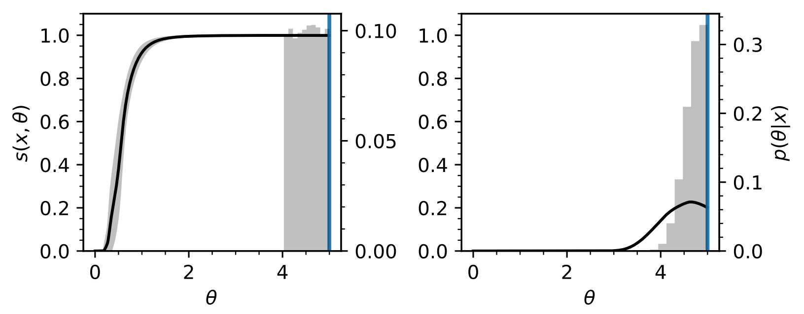
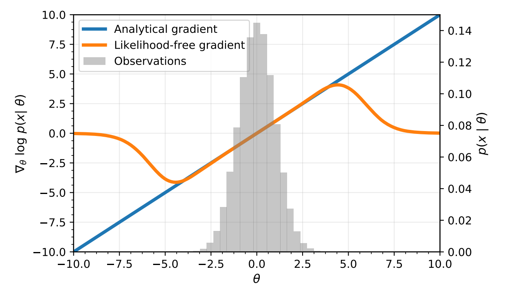
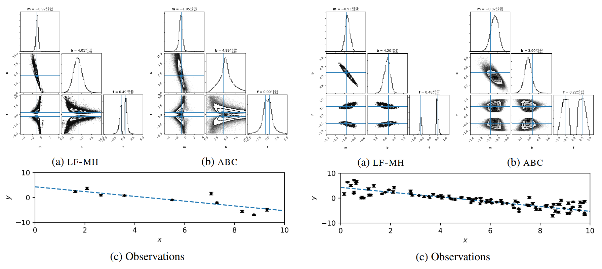
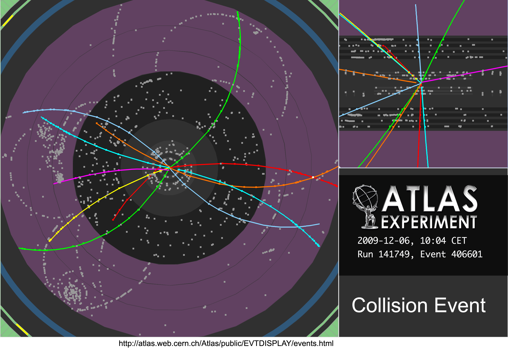

class: title-slide
count: false

# Likelihood-free Markov chain Monte Carlo using Approximate Likelihood Ratios

 

**Joeri Hermans**, .small[University of Liège] 
*Volodimir Begy*, .small[University of Vienna, CERN] 
*Gilles Louppe*, .small[University of Liège]

---
class: middle, center
# background
---
## Markov chain Monte Carlo

Consider the posterior density:

$$p(\theta\vert x) = \frac{p(\theta)p(x\vert\theta)}{p(x)}$$

Typically, the evidence $p(x)$ is intractable, but pointwise evaluations of the likelihood $p(x\vert\theta)$ are possible.

**Idea**: Approximate the posterior by creating a *chain* of *dependent* posterior samples through evaluating the transition $\theta_t \rightarrow \theta'$ using the *likelihood-ratio*.

$$
  \frac{p(\theta'\vert x)}{p(\theta_t\vert x)} =
  \frac{
    \displaystyle\frac{p(\theta')p(x\vert\theta')}{p(x)}
  }{
    \displaystyle\frac{p(\theta_t)p(x\vert\theta_t)}{p(x)}
  } =
  \frac{p(\theta')p(x\vert\theta')}{p(\theta_t)p(x\vert\theta_t)}
$$
$\rightarrow$ Does not depend on the intractable evidence $p(x)$!
---
### Metropolis-Hastings
> Initially proposed by Metropolis (1953), and later refined by Hastings (1970) to account for non-symmetric transition distributions.

**Idea**: introduce a transition distribution $q(\theta)$ to draw *proposals* $\theta'$.
    
.center.width-70[]

.footnote[
- Credit: animation from stata software.
- The transition distribution is also called the proposal distribution in literature.
]
---
### Issues with parameteric transition distributions
 
 
- **Sharp transition distribution**
 - High autocorrelation
 - High acceptance rate
- **Wide transition distribution**
 - Lower acceptance rate
 - Does not necessaraly mean a low autocorrelation, e.g., high rejection rate.
- **Multimodal posterior**
 - Can the transition distribution yield proposals which jump across different modes?

 
 
**Ideally**: the transition distribution should be identical in shape to the posterior.
---
### Hamiltonian Monte Carlo
> Designing appropriate transitions are annoying, can we get rid of them?

**Idea**: model the likelihood as a potential energy surface
$$U(\theta) = -\log p(x\vert\theta),$$
and assign some kinetic energy to the current state $\theta_t$
$$K(\theta) = \frac{1}{2}m^2~~~~\text{with}~m\sim q(m).$$
 
$\rightarrow$ Simulate Hamiltonian dynamics to extract a proposal $\theta'$!

- Significantly smaller autocorrelation
- Ability to capture different modes
- Comes at a computational cost, but has a higher acceptance rate.

---
.footnote[Taken from: https://chi-feng.github.io/mcmc-demo/]
<iframe style="position:absolute;top:0;left:0; z-order: -1;" width="100%" height="100%" src="https://chi-feng.github.io/mcmc-demo/app.html#HamiltonianMC,banana" frameborder="0" allowfullscreen></iframe>
---
class: middle, center
# problem setting

What if the likelihood $p(x\vert\theta)$ is also intractable?
 
 
$$p(\theta\vert x) = \frac{p(\theta)\cancel{p(x\vert\theta)}}{\cancel{p(x)}}$$
---
class: middle, center
# method

**tldr**: we build a model $s(x, \theta)$ which estimates the likelihood ratio, and embed the likelihood ratio model into common MCMC samplers.
---
## Approximate likelihood ratios
When comparing two hypothesis $\theta_0$ and $\theta_1$, one can train a classifier $s$ to distinguish samples
$x \sim p(x\vert\theta_0)$ and $x \sim p(x\vert\theta_1)$. This yields the optimal probablistic classifier

$$s(x) = \frac{p(x\vert\theta_0)}{p(x\vert\theta_0) + p(x\vert\theta_1)}.$$

**Why?**
---
## Proof
Let $Y = \\\{0, 1\\\}$, then the optimal classifier $s(x)$ is
$$s(x) = \underset{\phi}{\arg\min} \mathbb{E}\_{y\vert x}\left[(y - s\_\phi(x))^2\right]$$
$$\iff \underset{\phi}{\arg\min} \mathbb{E}\_{y\vert x}\left[y^2 - 2 s\_\phi(x)y + s\_\phi(x)^2\right]$$
$$\iff \underset{\phi}{\arg\min} \cancel{\mathbb{E}\_{y\vert x}x\left[y^2\right]} - 2 s\_\phi(x)\mathbb{E}\_{y\vert x}\left[y\right] + s\_\phi(x)^2$$
Which is minimized when
$$\frac{\partial}{\partial\phi}\left[- 2 s\_\phi(x)\mathbb{E}\_{y\vert x}\left[y\right] + s\_\phi(x)^2\right] = 0.$$
Solving for $s\_\phi(x)$ yields
$$s\_\phi(x) = \mathbb{E}\_{y\vert x}\left[y\right].$$
---
## Proof
For class labels $Y = \\\{0, 1\\\}$: $~\mathbb{E}\_{y\vert x}\left[y\right] = \cancel{0 \cdot p(y=0\vert x)} + 1 \cdot p(y=1\vert x).$
Then,
$$p(y=1\vert x) = \frac{p(y=1)p(x\vert y=1)}{p(x)},$$
$$\iff \frac{p(y=1)p(x\vert y=1)}{p(y=1)p(x\vert y=1) + p(y=0)p(x\vert y=0)}.$$
Assuming an equally balanced dataset $p(y=1) = p(y=0) = \frac{1}{2}$ we obtain,
$$\frac{p(x\vert y=1)}{p(x\vert y=1) + p(x\vert y=0)}.$$
Samples with $y=1$ are $x \sim p(x\vert\theta\_0)$ and $y=0$ are $x \sim p(x\vert\theta\_1)$, then
$$s(x) = \frac{p(x\vert\theta\_0)}{p(x\vert\theta\_0) + p(x\vert\theta\_1)}$$
---
## Approximate likelihood ratios
When comparing two hypothesis $\theta_0$ and $\theta_1$, one can train a classifier $s$ to distinguish samples
$x \sim p(x\vert\theta_0)$ and $x \sim p(x\vert\theta_1)$. This yields the optimal probablistic classifier

$$s(x) = \frac{p(x\vert\theta_0)}{p(x\vert\theta_0) + p(x\vert\theta_1)}.$$

Then the likelihood ratio $r(x)$ of $p(x\vert\theta_0)$ against $p(x\vert\theta_1)$ is,

$$r(x) = \frac{p(x\vert\theta_0)}{p(x\vert\theta_1)} = \frac{s(x)}{1 - s(x)}.$$

$\rightarrow$ *Supervised classification is equivalent to likelihood ratio estimation.*

**However**, training $s$ for every *hypothesis test* is rather cumbsersome...
---
### Parameterized classifiers
Include $\theta$ as input in $s(x, \theta)$ and use a *reference hypothesis* to classify against.

$$s(x, \theta) = \frac{p(x\vert\theta)}{p(x\vert\theta) + p(x\vert\theta_\text{ref})}$$

Then the $\log r(x, \theta_0, \theta_1)$ can be written as

$$\log r(x, \theta\_0, \theta\_1) = \log\frac{p(x\vert\theta\_0)}{p(x\vert\theta\_1)}= \log\frac{p(x\vert\theta\_0)}{p(x\vert\theta\_\text{ref})} - \log\frac{p(x\vert\theta\_1)}{p(x\vert\theta\_\text{ref})}.$$

Using the optimal classifier $s(x, \theta)$,

$$\log r(x, \theta\_0, \theta\_1) = \log\frac{s(x, \theta\_0)}{1 - s(x, \theta\_0)} - \log\frac{s(x, \theta\_1)}{1 - s(x, \theta\_1)}.$$

**Problem solved?**

$\rightarrow$ What if there is no support between $p(x\vert\theta)$ and $p(x\vert\theta\_\text{ref})$?

$\rightarrow$ Adds an additional hyperparameter to the optimization algorithm.
---
### Proposed solution

**Idea**: ensure support for all $\theta \in \Theta$ during training $\rightarrow$ proper constraints.

Train the classifier to distinguish samples from $p(x\vert\theta)$ and the $p(x)$.

Under this formalism, the decision function of $s(x, \theta)$ becomes

$$s(x, \theta) = \frac{p(x\vert\theta)}{p(x\vert\theta) + p(x)}.$$

 
.center.width-90[]
---
class: middle, center
# likelihood-free MCMC samplers
---
## Likelihood-free Metropolis-Hastings
Adapting Metropolis-Hastings into a likelihood-free alternative is quite trivial. We just have to modify the likelihood ratio evaluation from

$$\log r(O, \theta', \theta\_t) = \sum\_{x \in O} \log p(x\vert\theta') - \sum\_{x \in O} \log p(x\vert\theta_t)$$

to

$$\log r(O, \theta', \theta\_t) = \sum\_{x \in O} \log\frac{s(x,\theta')}{1 - s(x,\theta')} - \sum\_{x \in O}\log\frac{s(x,\theta\_t)}{1 - s(x,\theta\_t)}.$$

---
## Likelihood-free Hamiltonian Monte Carlo

To simulate the Hamiltonian dynamics, Hamiltonian Monte Carlo requires
$$\nabla\_\theta~U(\theta) \triangleq -\nabla\_\theta~\log p(x\vert\theta).$$
**Tricky**, we need $-\nabla\_\theta~\log p(x\vert\theta)$...

**Observation**: remember that
$$\nabla\_\theta \log p(x\vert\theta) \equiv -\frac{\nabla_\theta~p(x\vert\theta)}{p(x\vert\theta)},$$
and we have access the a *differentiable* classifier $s(x, \theta)$ (neural network).
---
Assuming an optimal classifier $s(x, \theta)$.
$$\nabla\_\theta \log p(x\vert\theta) = -\frac{\displaystyle\frac{\partial}{\partial\theta}\left[\frac{s(x, \theta)}{1 - s(x, \theta)}\right]}{\displaystyle \frac{s(x, \theta)}{1 - s(x, \theta)}}$$

$$\iff \nabla\_\theta \log p(x\vert\theta) = -\frac{\displaystyle\frac{\partial}{\partial\theta}\left[\frac{p(x\vert\theta)}{p(x)}\right]}{\displaystyle \frac{p(x\vert\theta)}{p(x)}}$$

$$\iff \nabla\_\theta \log p(x\vert\theta) = -\frac{\displaystyle\frac{1}{p(x)}\nabla\_\theta~p(x\vert\theta)}{\displaystyle\frac{1}{p(x)}p(x\vert\theta)}$$

$$\iff \nabla\_\theta \log p(x\vert\theta) = -\frac{\nabla\_\theta~p(x\vert\theta)}{p(x\vert\theta)}$$
---
class: middle
Even with approximate classifiers this still works reasonably well:

.center.width-100[]

**Interesting**: discrepancy between the closed form and approximation!
---
class: middle, center
# some results
(finally)
---
## Linear probabilistic model
 
 
.center.width-100[]
 
Problem independent parameterized classifier $s(x, \theta)$ (trained once).
---
class: middle
.center.width-100[]
---
## Particle tracker alignment
.center.width-60[]
---
class: middle, center
# in practice
---
class: middle, center
# future work
---
class: end-slide, center
count: false

fin
 
 
 
https://joerihermans.com/papers/lfmcmc.pdf
